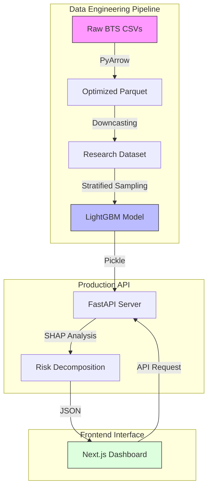

# ✈️ AeroMetric: Aviation Intelligence Hub
### *Predicting Flight Delays through Operational Research & Data Science*

[](https://www.python.org/)
[](https://nextjs.org/)
[](https://fastapi.tiangolo.com/)
[](https://lightgbm.readthedocs.io/)

---

## 📖 Overview
AeroMetric is a data science platform designed to analyze and predict flight delays. Using a dataset of **5.8 million historical flights**, the system identifies structural risk factors and provides real-time probability scores with explainable AI (XAI) diagnostics.

### 📸 System Preview


---

## 🏗️ System Architecture
The project is engineered as a decoupled pipeline, separating heavy data processing from the user interface to ensure performance and scalability.



---

## 🛠️ Technical Implementation

### 1. Data Engineering
**Goal**: Process 5.8M records on local hardware without memory failure.
- **Storage Optimization**: Migrated from CSV to **Apache Parquet**, reducing disk footprint and increasing I/O speed by 10x.
- **Memory Management**: Implemented **Type Downcasting** (e.g., `float64` $\rightarrow$ `float32`, `int64` $\rightarrow$ `int16`), allowing the full dataset to fit into system RAM.
- **Feature Encoding**: 
    - **Cyclic Encoding**: Used Sine/Cosine transforms for departure times to preserve the 24-hour temporal relationship.
    - **Target Encoding**: Mapped high-cardinality airports and airlines to their historical delay probabilities to avoid dimensionality explosion.

### 2. Machine Learning & XAI
**Goal**: Build a predictive model that is both accurate and transparent.
- **Model Selection**: Used **LightGBM** for its efficiency with tabular data and native handling of categorical features.
- **Explainability**: Integrated **SHAP (Shapley Additive Explanations)** to decompose every prediction. This allows the system to quantify exactly how much a specific airline or time of day contributed to the risk score.
- **Validation**: Used **Stratified Sampling** (500k records) to ensure the training set maintained the original distribution of delays.

### 3. Software Architecture
**Goal**: Create a production-ready environment for the model.
- **Backend**: **FastAPI** provides a high-performance REST API, containerized with **Docker** for environment consistency.
- **Frontend**: **Next.js 15** with a Glassmorphism UI, designed for high-density data visualization.
- **Deployment**: Hybrid cloud strategy using **Vercel** (Frontend) and **Railway/Render** (Backend).

---

## 🧪 Key Research Findings
Through statistical analysis (Chi-Square and ANOVA), the following operational drivers were validated:
- **Temporal Risk**: A significant delay peak occurs between **18:00 and 22:00**, caused by cascading disruptions throughout the day.
- **Carrier Impact**: Airline choice is a primary structural driver of risk, independent of the flight route.
- **LCC Volatility**: Low-cost carriers (e.g., Spirit, Frontier) exhibit higher "Miss Rates," suggesting a predictability ceiling due to tighter operational turnarounds.

---
 
## 🛠️ The Engineering Journey: Challenges & Resolutions

Building a production-ready ML system revealed several critical bottlenecks. Below is the technical breakdown of the hurdles overcome during development.

### 📊 Data Science & ML Hurdles
- **The Scale Problem**: Handling 5.8M records caused immediate memory overflows. I resolved this by implementing **Apache Parquet** for storage and **Type Downcasting**, reducing the memory footprint by ~70% without losing precision.
- **Dimensionality Explosion**: With hundreds of airports, one-hot encoding would have created a sparse matrix too large for efficient training. I implemented **Target Encoding** to compress this high-cardinality data into meaningful risk coefficients.
- **The "Black Box" Dilemma**: A raw probability score is useless for operational decision-making. I integrated **SHAP (Shapley Additive Explanations)** to provide feature-level transparency, transforming the model from a "predictor" into a "diagnostic tool."

### ⚙️ Systems & Deployment Hurdles
- **The "Container Wall"**: Initial Docker deployments failed due to pathing mismatches between the local OS and the Linux container. I resolved this by implementing absolute pathing and a root-context build strategy in the `Dockerfile`.
- **CORS & Gateway Deadlocks**: Connecting a Vercel frontend to a Railway backend triggered strict browser CORS policies. I solved this by configuring a stateless CORS middleware with `allow_credentials=False`, enabling seamless communication across dynamic Vercel preview domains.
- **Startup Latency (Cold Starts)**: Loading the model and dataset caused Railway health checks to timeout. I implemented a **Fast-Start Lifespan** pattern, allowing the server to bind to the port instantly and load heavy assets in the background.

---

## 🚀 Local Setup

### Backend
```bash
cd backend
pip install -r ../requirements.txt
uvicorn api:app --reload
```

### Frontend
```bash
cd frontend
npm install
npm run dev
```

---

**Developed as a technical exploration into Aviation Operational Research.**
