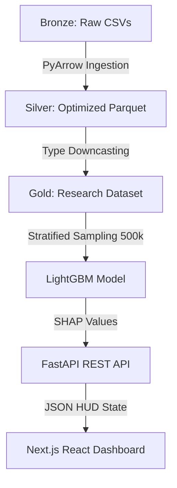

# ✈️ AeroMetric: Aviation Intelligence Hub
### *Predicting Flight Delays with Machine Learning & Production Engineering*

[](https://www.python.org/)
[](https://nextjs.org/)
[](https://fastapi.tiangolo.com/)
[](https://lightgbm.readthedocs.io/)

---

## 🌟 The Mission
Flight delays aren't just annoying—they cost the global economy billions. Most tools just tell you *that* a flight is delayed. **AeroMetric** does something different: it predicts the **probability of a delay** and explains **exactly why** it's happening using Explainable AI (SHAP).

I built this to demonstrate how to handle "Big Data" (5.8M+ records) on local hardware and transform it into a scalable, production-ready research platform.

### 📸 Project Preview

*Caption: The AeroMetric HUD illustrating live delay probabilities, Radar-based risk factor mapping, and SHAP diagnostics against a modern airport backdrop.*

---

## 🧪 Research Methodology & Statistical Proofs

Instead of chasing raw accuracy, this project uses statistical validation to uncover the actual structural drivers of aviation risk.

### Hypothesis Testing (Verified Results)
| Hypothesis | Statistical Test | Result | P-Value | Conclusion |
| :--- | :--- | :--- | :--- | :--- |
| **H1: Time of Day** | Chi-Square | **Validated** | < 0.001 | Significant delay peak between 18:00 and 22:00. |
| **H2: Airline Choice** | One-Way ANOVA | **Validated** | < 0.001 | Carrier performance is a structural, non-random driver. |
| **H3: Distance** | Pearson Correlation| **Rejected** | 0.067 | Distance is a weak predictor of delay magnitude. |

---

## 🏗️ ML Pipeline Architecture

We implemented a **Medallion Architecture** to handle 5.8M+ records efficiently:



---

## 🛠️ How it Works (Engineering Deep-Dive)

### 1. Data Engineering at Scale
*   **Parquet Migration**: Converted raw CSVs to Apache Parquet, reducing memory footprint by ~50% and increasing load speeds by 10x.
*   **Memory Downcasting**: Systematically converted `float64` to `float32` and `int64` to `int16/int8`, enabling the 5.8M record dataset to fit into standard RAM.

### 2. Advanced Feature Engineering
*   **Temporal Periodicity**: Implemented **Sine/Cosine cyclic encoding** for departure times to capture the natural 24-hour cycle of aviation logistics.
*   **High-Cardinality Mapping**: Applied **Target Encoding** to Airlines and Airports to transform categorical labels into actionable probability scores.

### 3. Explainable ML (SHAP Diagnostics)
AeroMetric uses **SHAP (Shapley Additive Explanations)** to decompose every live prediction. The "Risk Indicators" in the UI are not guesses—they are mathematical breakdowns of how specific variables (like a Spirit flight or a late-night departure) pushed the probability upward.

---

## 📉 Core Finding: The "LCC Reality Gap"

Through deep error analysis of **False Negatives** (Unexpected Delays), we discovered a critical "Predictability Ceiling":
> **Carrier Volatility:**
> Low-cost carriers like **Spirit (NK)** and **Frontier (F9)** exhibit the highest "Miss Rates." Their tight operational models (minimal spare aircraft, tight turns) create a volatility that schedule data alone cannot predict—a core finding for future aviation research.

---

## 🚀 Get Started Locally

1. **Clone & Install**
   ```bash
   git clone https://github.com/your-username/aviation-project.git
   cd aviation-project
   pip install -r requirements.txt
   ```

2. **Run the Engine**
   - Backend: `cd backend && uvicorn api:app --reload`
   - Frontend: `cd frontend && npm run dev`

---

## 🎓 Key Portfolio Takeaways
*   **Scale over Recency**: Handled 5.8M rows locally using optimized data typing.
*   **Combatting the "COVID Anomaly"**: Strategically used 2015 data to learn standard aviation logistics, avoiding the "pandemic noise" of 2020-2022.

---

**Developed with ❤️ and Rigorous Data Science.**
