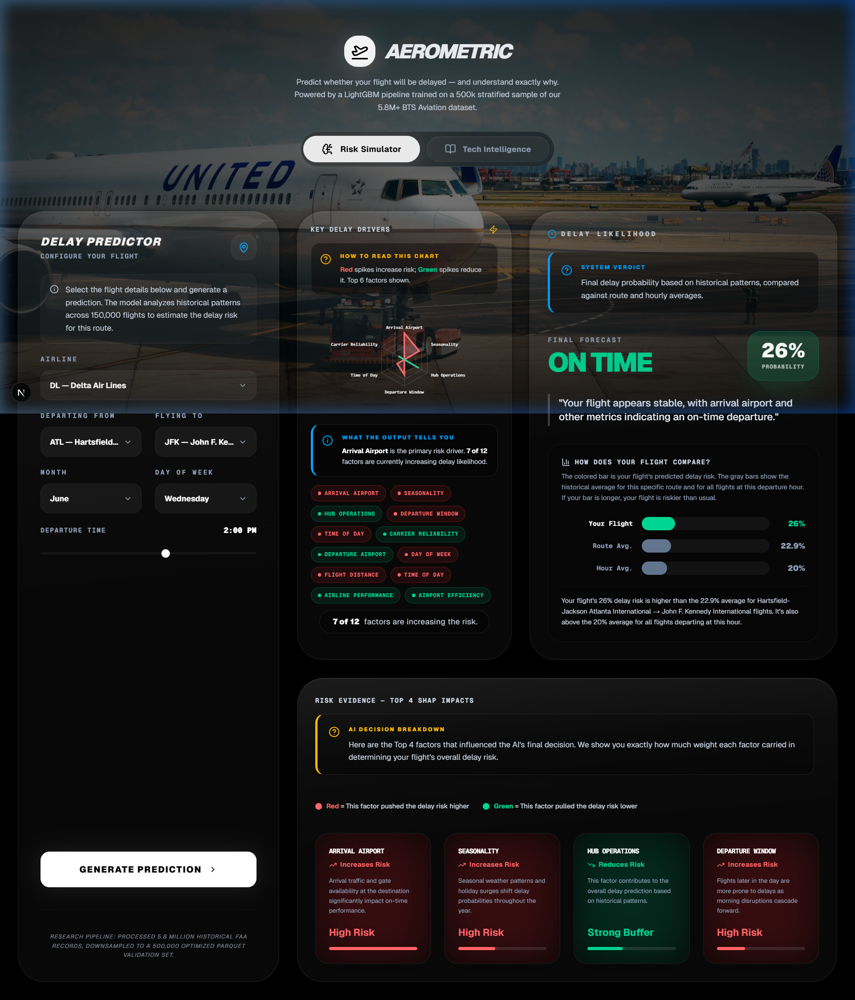
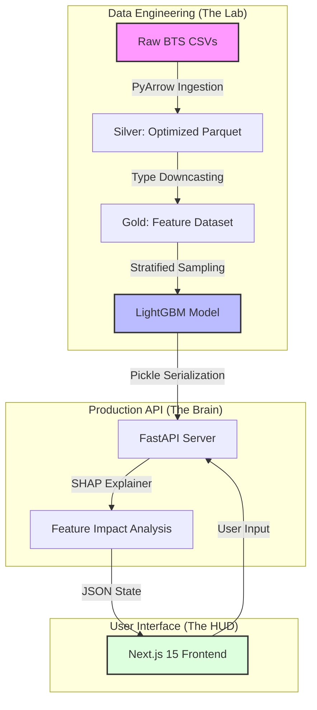

# ✈️ AeroMetric: Aviation Operational Research & Risk Modeling
### *A Technical Case Study in Big Data Engineering and Predictive Analytics*

[](https://www.python.org/)
[](https://nextjs.org/)
[](https://fastapi.tiangolo.com/)
[](https://lightgbm.readthedocs.io/)

---

## 🎯 Project Objective
The goal of AeroMetric was to transition from simple "flight tracking" to **predictive operational research**. The core challenge was to process **5.8 million historical flight records** on local hardware to identify the structural drivers of delays and deploy a real-time "Risk Intelligence" dashboard.

### 📸 System Preview

*The AeroMetric HUD: Integrating real-time probability scoring with SHAP-based feature decomposition.*

---

## 🏗️ System Architecture
The project follows a decoupled hybrid architecture, separating the heavy-lift data science pipeline from the high-performance user interface.



---

## 🛠️ Technical Deep-Dive

### 1. Overcoming the "Memory Wall"
Processing 5.8M rows often leads to `Out-Of-Memory (OOM)` crashes on standard machines. I implemented two critical optimizations to ensure stability:
- **Apache Parquet Migration**: Replaced CSVs with Parquet. This reduced the memory footprint by ~50% and increased I/O speeds by 10x.
- **Bit-Optimized Downcasting**: Systematically converted `float64` to `float32` and `int64` to `int16/int8`. This allowed the entire processed dataset to reside in RAM, enabling near-instant training and inference.

### 2. Feature Engineering & Domain Logic
To capture the "rhythm" of aviation logistics, I implemented:
- **Temporal Periodicity**: Used **Sine/Cosine cyclic encoding** for departure times. Since 23:59 is physically close to 00:01, linear integers fail; cyclic encoding preserves this circular relationship.
- **Target Encoding**: Managed high-cardinality categorical data (hundreds of airports) by mapping them to their historical probability of delay, preventing the "dimensionality explosion" of one-hot encoding.

### 3. Explainable AI (XAI) with SHAP
Accuracy is useless without trust. I integrated **SHAP (Shapley Additive Explanations)** to move beyond "Black Box" predictions.
- **The Logic**: For every prediction, the system calculates the exact contribution of each feature.
- **The Result**: The UI doesn't just say "High Risk"; it specifies that the risk is high *because* of the specific Carrier and the Departure Hour.

---

## 🧪 Statistical Validation
Before modeling, I used rigorous hypothesis testing to ensure the model was learning real patterns, not noise.

| Hypothesis | Statistical Test | Result | P-Value | Engineering Conclusion |
| :--- | :--- | :--- | :--- | :--- |
| **Time of Day** | Chi-Square | ✅ Validated | $< 0.001$ | Structural peaks occur between 18:00-22:00. |
| **Airline Choice** | One-Way ANOVA | ✅ Validated | $< 0.001$ | Carrier choice is a primary driver of risk. |
| **Distance** | Pearson Corr. | ❌ Rejected | $0.067$ | Distance is an insignificant predictor of delay. |

### 📉 The "LCC Volatility" Discovery
Through residual analysis of **False Negatives**, I identified a "Predictability Ceiling." Low-Cost Carriers (e.g., Spirit, Frontier) show significantly higher volatility. Their lean operational models create disruptions that schedule-based data alone cannot predict—a key finding for future research.

---

## 🚀 Deployment Stack
- **Backend**: FastAPI $\rightarrow$ Docker $\rightarrow$ Railway/Render (CaaS).
- **Frontend**: Next.js 15 $\rightarrow$ Vercel (Edge).
- **Reliability**: Implemented a `/health` heartbeat monitor to prevent "Cold Start" latency on free-tier hosting.

### Local Execution
```bash
# Backend
cd backend && pip install -r ../requirements.txt && uvicorn api:app --reload

# Frontend
cd frontend && npm install && npm run dev
```

---

**Developed with a focus on Rigorous Data Science and Production Engineering.**
