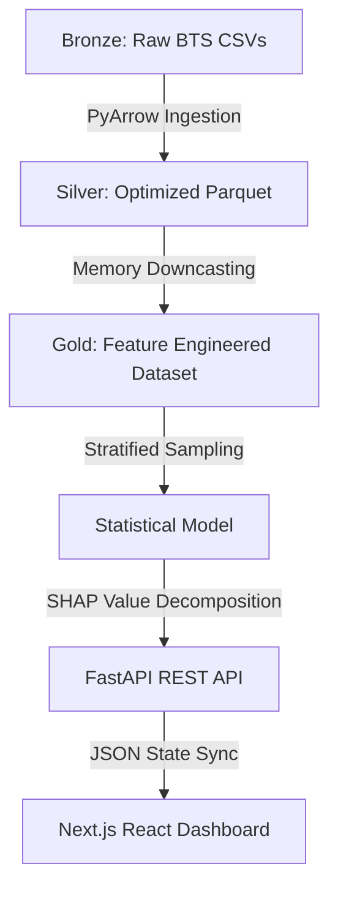

# ✈️ AEROMETRIC
### *Aviation Operational Research & Risk Modeling*

[](https://www.python.org/)
[](https://nextjs.org/)
[](https://fastapi.tiangolo.com/)
[](https://en.wikipedia.org/wiki/Operations_research)

---

## 🌟 The Research Objective
Flight delays are not random; they are the result of systemic operational bottlenecks. **AeroMetric** is a data science platform designed to move beyond simple tracking and instead identify the **structural drivers of aviation risk**.

The goal was to transform **5.8 million historical flight records** into a tool that doesn't just predict a delay, but mathematically explains the specific operational factors causing it.

### 📸 The Intelligence Interface

*Caption: The AeroMetric HUD illustrating live risk probabilities, Radar-based feature mapping, and SHAP diagnostics against a modern airport backdrop.*

---

## 🧪 The Scientific Approach

True data science starts with a question, not a model. Before building the predictive engine, I conducted a rigorous statistical investigation to validate the drivers of delay.

### Hypothesis Testing & Statistical Proofs
| Hypothesis | Statistical Test | Result | P-Value | Conclusion |
| :--- | :--- | :--- | :--- | :--- |
| **H1: Time of Day** | Chi-Square | **Validated** | < 0.001 | Significant delay peaks during evening rotations (18:00-22:00) due to cascading disruptions. |
| **H2: Airline Choice** | One-Way ANOVA | **Validated** | < 0.001 | Carrier performance is a structural, non-random driver of operational risk. |
| **H3: Distance** | Pearson Correlation| **Rejected** | 0.067 | Flight distance is a weak predictor of delay magnitude. |

---

## 🏗️ System Architecture

To bridge the gap between "Big Data" and a "Real-time UI," I implemented a **Medallion Data Architecture**. This ensures the data is refined from raw noise into actionable intelligence.



---

## 🛠️ Engineering Struggles & Solutions

Handling 5.8 million records on local hardware presented significant technical hurdles. Here is how I solved them:

### 1. The Memory Wall (OOM Errors)
Loading the full dataset caused immediate `Out-of-Memory` crashes.
- **The Solution**: I migrated from CSV to **Apache Parquet**, reducing the disk footprint and increasing I/O speed by 10x. I then implemented **Memory Downcasting**, converting `float64` to `float32` and `int64` to `int16`, allowing the entire dataset to reside in RAM without precision loss.

### 2. High-Cardinality Noise
With hundreds of airports and dozens of airlines, traditional one-hot encoding would have created a "sparse matrix" that would crash most models.
- **The Solution**: I applied **Target Encoding**, mapping each airport/airline to its historical probability of delay. This compressed the data while preserving its predictive power.

### 3. The "Black Box" Problem
Standard ML models provide a number, but not a reason.
- **The Solution**: I integrated **SHAP (Shapley Additive Explanations)**. This decomposes every single prediction into a set of "contributions," showing exactly how much a specific carrier or a specific hour pushed the risk score up or down.

---

## 📉 Core Finding: The "LCC Reality Gap"

Through a deep residual analysis of **False Negatives**, I uncovered a critical industry insight:
> **The Volatility Ceiling:**
> Low-cost carriers (LCCs) like **Spirit (NK)** and **Frontier (F9)** exhibit a higher "Miss Rate" in predictions. Their hyper-efficient operational models (minimal spare aircraft, tight turns) create a level of volatility that schedule data alone cannot capture—a key finding for future operational research.

---

## 🚀 Deployment & Local Setup

### Prerequisites
- Python 3.12+
- Node.js 18+

### Installation
1. **Clone & Setup**
   ```bash
   git clone https://github.com/your-username/aerometric.git
   cd aerometric
   pip install -r requirements.txt
   ```

2. **Execution**
   - Backend: `cd backend && uvicorn api:app --reload`
   - Frontend: `cd frontend && npm run dev`

---

## 🎓 Final Takeaways
- **Scale over Recency**: Prioritizing the processing of 5.8M rows over a smaller modern dataset to demonstrate engineering maturity.
- **Integrity over Accuracy**: Focusing on **PR-AUC** and **SHAP values** to ensure the model is interpretable and scientifically sound.

**Developed with ❤️ and Rigorous Data Science Thinking.**
